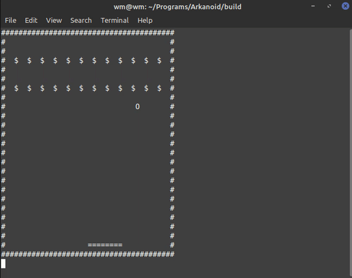
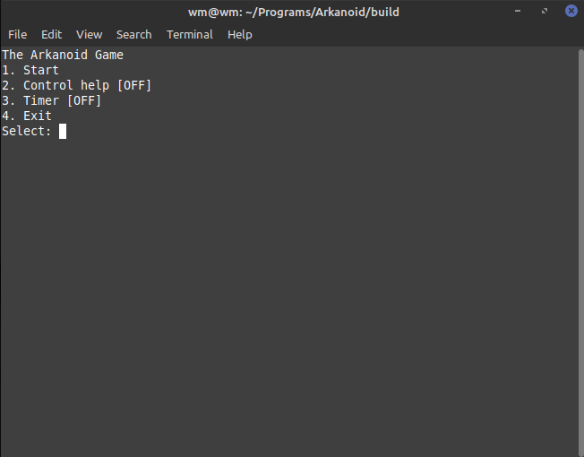
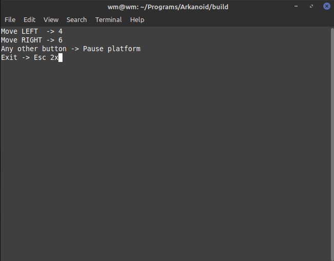
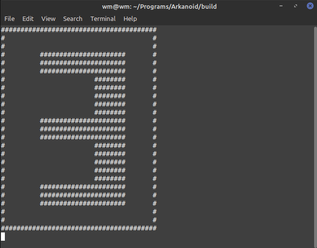
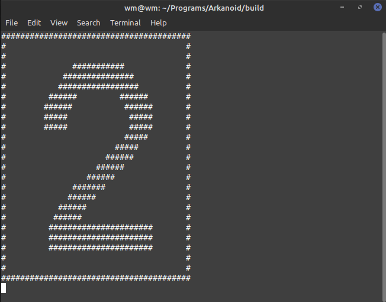
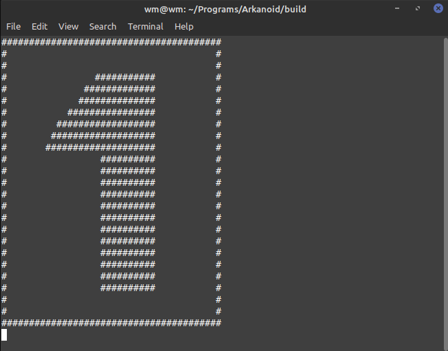

# Arkanoid
Hello everyone!
The project is the second version of my Arkanoid game (resize the terminal to min. 80x27). The first one was deleted because it was unplayable.
In this case, once I understood a few of my mistakes from an old project, so I made that version. 
But I know that some thinks could be better. For example, I should use a list to storage a points instead of vector.
I split view (display) and contol (keyboard input) to two seperate threads. Moreover I used cmake to build the project (lncurses and pthread have to be linked). 
I have been doing it for few weeks and it is now complete. Below you can see an example of the game and some images:

*GAMEPLAY*

--------------------------------------------------------------------------------------------------------------------

*MENU*
- Controller help and timer turn ON/OFF.

--------------------------------------------------------------------------------------------------------------------

*HELP*
- When ON, it is displayed after the menu.

--------------------------------------------------------------------------------------------------------------------

*TIMER*
- When ON, it is displayed after the help.

--------------------------------------------------------------------------------------------------------------------
